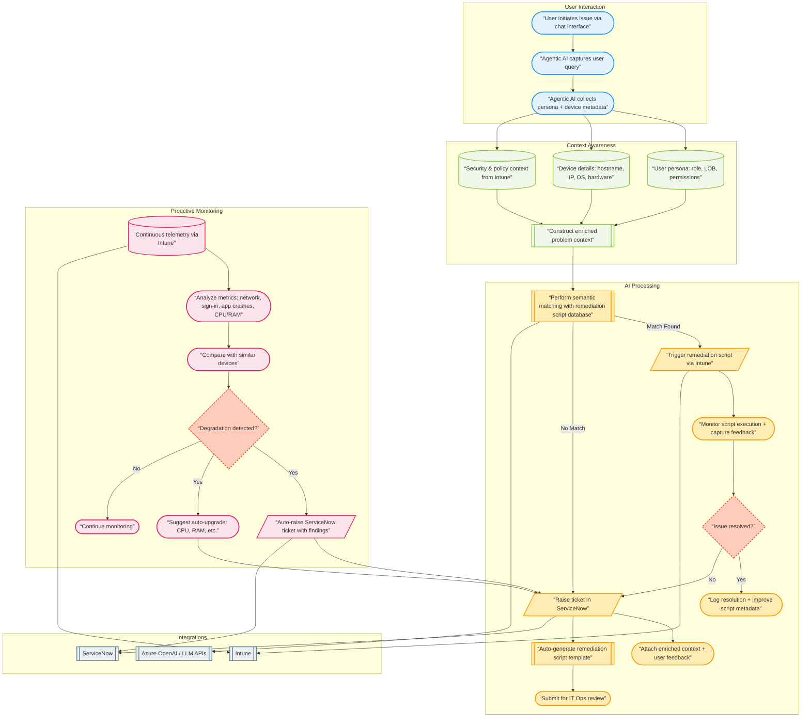

```mermaid
flowchart TD
 subgraph UI["User Interaction"]
    direction TB
        A1(["“User initiates issue via chat interface”"])
        A2(["“Agentic AI captures user query”"])
        A3(["“Agentic AI collects persona + device metadata”"])
  end
 subgraph CT["Context Awareness"]
    direction TB
        B1[("“User persona: role, LOB, permissions”")]
        B2[("“Device details: hostname, IP, OS, hardware”")]
        B3[("“Security & policy context from Intune”")]
        C1[["“Construct enriched problem context”"]]
  end
 subgraph AI["AI Processing"]
    direction TB
        C2[["“Perform semantic matching with remediation script database”"]]
        C3[/"“Trigger remediation script via Intune”"/]
        C4[/"“Raise ticket in ServiceNow”"/]
        C5(["“Monitor script execution + capture feedback”"])
        C6{"“Issue resolved?”"}
        C7(["“Log resolution + improve script metadata”"])
        C8(["“Attach enriched context + user feedback”"])
        C9[["“Auto‑generate remediation script template”"]]
        C10(["“Submit for IT Ops review”"])
  end
 subgraph PM["Proactive Monitoring"]
    direction TB
        D1[("“Continuous telemetry via Intune”")]
        D2(["“Analyze metrics: network, sign‑in, app crashes, CPU/RAM”"])
        D3(["“Compare with similar devices”"])
        D4{"“Degradation detected?”"}
        D5[/"“Auto‑raise ServiceNow ticket with findings”"/]
        D6(["“Suggest auto‑upgrade: CPU, RAM, etc.”"])
        D7(["“Continue monitoring”"])
  end
 subgraph INT["Integrations"]
    direction LR
        E1[["Intune"]]
        E2[["ServiceNow"]]
        E3[["Azure OpenAI / LLM APIs"]]
  end
    A1 --> A2
    A2 --> A3
    A3 --> B1 & B2 & B3
    B1 --> C1
    B2 --> C1
    B3 --> C1
    C1 --> C2
    C2 -- Match Found --> C3
    C2 -- No Match --> C4
    C3 --> C5 & E1
    C5 --> C6
    C6 -- Yes --> C7
    C6 -- No --> C4
    C4 --> C8 & C9 & E2
    C9 --> C10
    D1 --> D2 & E1
    D2 --> D3
    D3 --> D4
    D4 -- Yes --> D5 & D6
    D4 -- No --> D7
    D5 --> C4 & E2
    D6 --> C4
    C2 --> E3

     A1:::userInt
     A2:::userInt
     A3:::userInt
     B1:::context
     B2:::context
     B3:::context
     C1:::context
     C2:::aiProc
     C3:::aiProc
     C4:::aiProc
     C5:::aiProc
     C6:::decision
     C7:::aiProc
     C8:::aiProc
     C9:::aiProc
     C10:::aiProc
     D1:::monitor
     D2:::monitor
     D3:::monitor
     D4:::decision
     D5:::monitor
     D6:::monitor
     D7:::monitor
     E1:::integration
     E2:::integration
     E3:::integration
    classDef userInt   fill:#E3F2FD,stroke:#2196F3,stroke-width:2px
    classDef context   fill:#F1F8E9,stroke:#8BC34A,stroke-width:2px
    classDef aiProc    fill:#FFECB3,stroke:#FF9800,stroke-width:2px
    classDef decision  fill:#FFCCBC,stroke:#E64A19,stroke-width:2px,stroke-dasharray: 5 3
    classDef monitor   fill:#FCE4EC,stroke:#E91E63,stroke-width:2px
    classDef integration fill:#ECEFF1,stroke:#607D8B,stroke-width:2px


```
